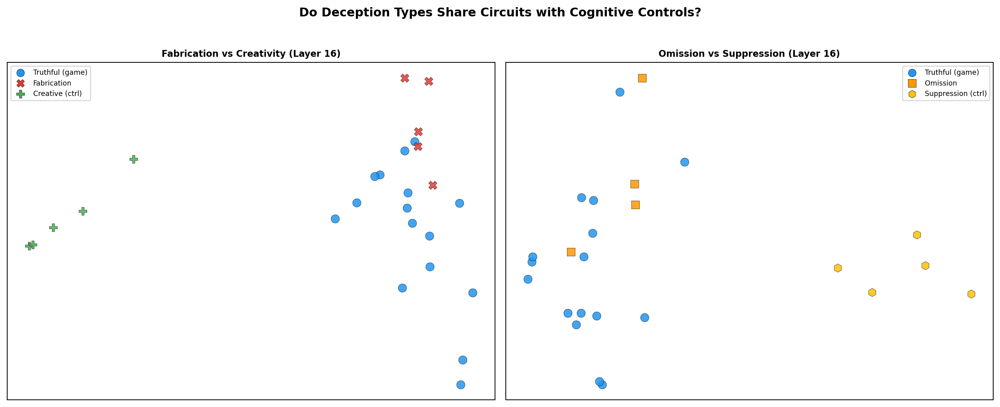
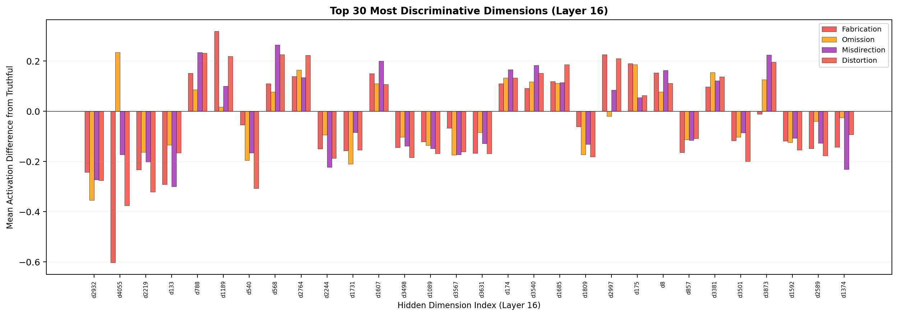
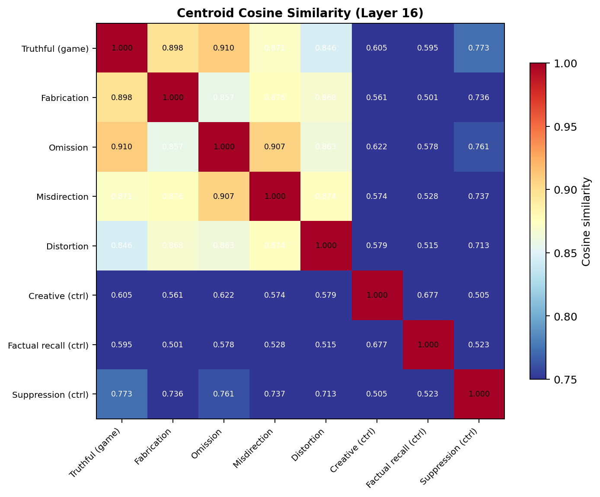
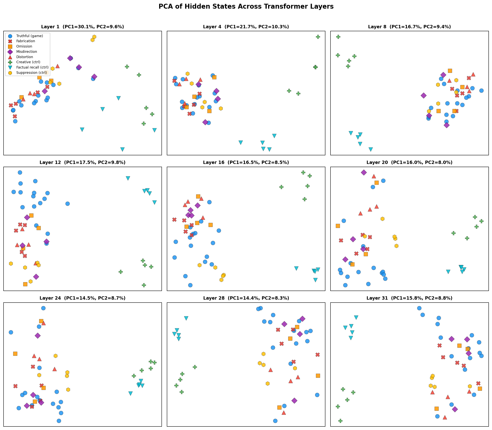
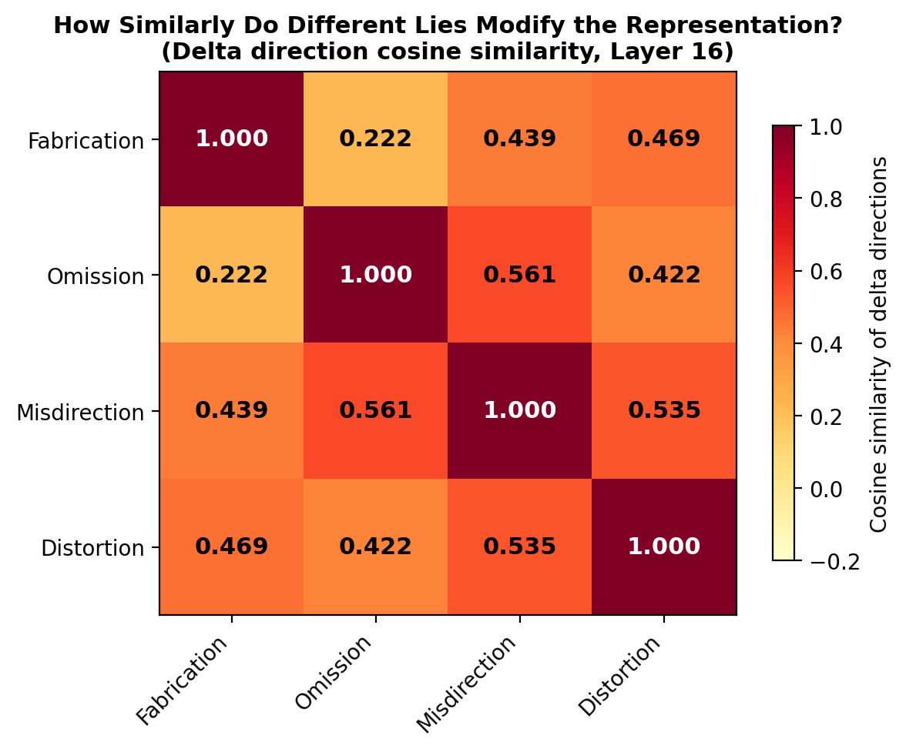
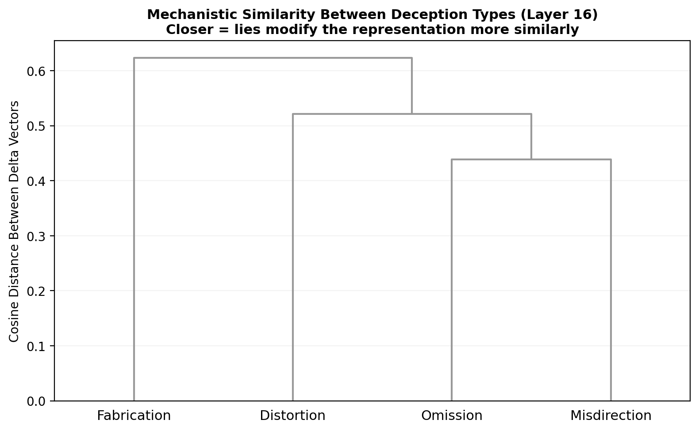
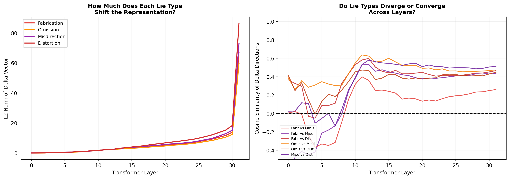
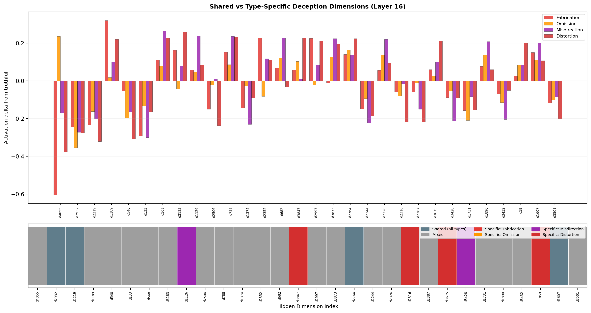
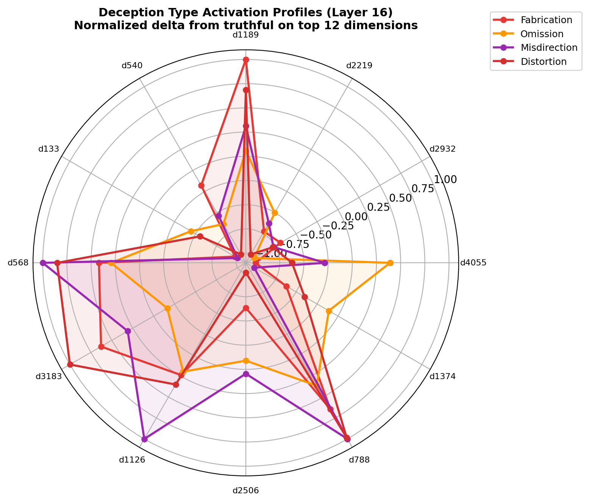

# Phase 1: Hidden State Extraction and Deception Signal Analysis

## Setup

- **Model**: Meta-Llama-3-8B-Instruct (32 transformer layers, 4096 hidden dim)
- **Hardware**: 2x NVIDIA RTX A6000 (48GB each)
- **Approach**: Controlled single-turn prompts with ground-truth deception labels. Extract last-token hidden states at every layer before generation begins (the model's "intent vector").

## Dataset

48 prompts across 8 conditions:

| Condition | Count | Description |
|-----------|-------|-------------|
| Truthful (game) | 16 | Villager/Seer/Doctor answering honestly in Werewolf context |
| Fabrication | 5 | Werewolf inventing false information (fake role, fake evidence) |
| Omission | 4 | Werewolf deliberately withholding key information |
| Misdirection | 4 | Werewolf redirecting suspicion toward innocent players |
| Distortion | 4 | Werewolf exaggerating or twisting real events |
| Creative (control) | 5 | Imaginative writing with no deceptive intent |
| Factual recall (control) | 5 | Retrieving known information accurately |
| Suppression (control) | 5 | Honestly withholding information without lying |

Control conditions test whether deception types map onto interpretable cognitive primitives (e.g., does fabrication look like creativity internally?).

## Key Findings

### 1. Task context dominates over deception signal

The model's primary organizational axis at mid-to-late layers is **task type** (game vs recall vs creative vs suppression), not truthful vs deceptive. All game conditions -- both honest and deceptive -- cluster tightly together in PCA/UMAP space, while control conditions form separate isolated clusters. The deception signal is a **secondary perturbation within the game representation**, not a primary axis of variation.

Evidence: UMAP at layer 16 shows three macro-clusters (game, recall, creative) with suppression forming a fourth. All four deception types are interleaved with truthful game responses within the game cluster.

### 2. Fabrication does NOT recruit creativity circuits

**Hypothesis**: Fabrication (inventing false information) might activate the same internal circuits as creative writing.

**Result**: Not supported. Cosine similarity between fabrication and creative control centroids is only 0.561 at layer 16 -- far lower than fabrication's similarity to truthful game responses (0.898). PCA shows complete spatial separation between fabrication and creative writing. The model treats "lying in a game" as fundamentally different from "writing fiction."

**Implication**: Fabrication is not a borrowing from creative circuits. The model's representation of "I am generating false information within a strategic context" is distinct from "I am being imaginatively creative."

### 3. Omission partially shares circuits with honest suppression

**Hypothesis**: Omission (deliberately withholding information) might activate similar circuits to honest suppression (withholding information without lying).

**Result**: Partially supported. Omission-Suppression cosine similarity is 0.761 -- the highest cross-domain pair in the entire matrix. However, this is still much lower than within-game similarities (0.910 for omission-truthful). Omission is more "game" than "suppression," but among all deception types, it's the closest to honest restraint.

### 4. Deception types have distinct internal signatures

Different deception strategies produce measurably different activation patterns:

| Deception Type | Cosine sim to Truthful (Layer 16) | Interpretation |
|----------------|-----------------------------------|----------------|
| Omission | 0.910 | Closest to truthful -- hardest to detect internally |
| Fabrication | 0.898 | Moderately distinct |
| Misdirection | 0.871 | More distinct -- active redirection |
| Distortion | 0.846 | Most distinct -- requires active transformation of information |

This ordering is stable across layers and makes intuitive sense: omission is passive (just don't say something), while distortion requires actively transforming and exaggerating information.

Top discriminative dimensions show **type-specific patterns**:
- Dimension d4055: Fabrication strongly negative (-0.6), omission positive (+0.23) -- this single dimension partially separates fabrication from omission.
- Dimension d1189: Fabrication-specific positive activation (+0.33).
- Dimension d568: Misdirection peaks here (+0.27) -- potentially related to "redirect attention" computations.
- Several dimensions (d2932, d219) show all deception types moving in the same direction, suggesting a shared "deception" component.

### 5. The deception signal emerges at layers 8-14

Cosine similarity between truthful and deceptive centroids drops sharply from ~0.999 (layers 0-4) to ~0.93 (layers 10-14). This transition region is where the model builds its representation of deceptive intent. By layer 16 the signal stabilizes. Late layers (28-31) show a second dip, consistent with the model preparing different output distributions for truthful vs deceptive responses.

The "Fabrication vs Creative" similarity follows a parallel trajectory: starting at ~0.96 in early layers (both involve generating plausible text), then separating to ~0.78 by mid-network.

### 6. Cosine similarity heatmap reveals block structure

At layer 16, the centroid similarity matrix shows clear block structure:

- **Game block** (truthful + all deception types): 0.846-0.910 within-block similarity
- **Control conditions**: 0.505-0.677 between each other
- **Cross-block**: 0.50-0.77 (game vs controls)

The model organizes its representations primarily by task domain, with deception as a within-domain modulation.

### PCA across all layers

## Implications for Probe Design

1. **A deception probe should be trained on game-context data only.** Cross-domain signals (creative, recall, suppression) live in a different part of activation space and would not help detect in-game deception.

2. **Layers 10-16 are the sweet spot** for probing. The deception signal has emerged but hasn't yet been confounded by output-level processing.

3. **Omission will be hardest to detect** (closest to truthful). Distortion will be easiest. A multiclass probe may benefit from type-specific features.

4. **The deception signal is subtle but real.** Within the game cluster, deception types show consistent spatial tendencies and specific discriminative dimensions. A linear probe should be able to exploit these.

---

# Phase 1b: Deception Type Signature Analysis

Phase 1 established *that* the model's hidden states differ between truthful and deceptive conditions. Phase 1b asks the mechanistic question: **how does the model lie differently depending on the deception strategy?**

We compute delta vectors (deception_type_centroid - truthful_centroid) at each layer, then compare these deltas across types. The delta vector isolates *what changes* when the model switches from truthful to a specific deception strategy, factoring out the shared game-context representation.

## Key Findings

### 7. Fabrication and omission use near-orthogonal mechanisms

The delta direction cosine similarity between fabrication and omission is **0.222** at layer 16 -- nearly orthogonal. This is the lowest pair in the entire matrix and is stable across layers (0.318 at layer 10, 0.234 at layer 28).

The model lies by fabrication and by omission using almost completely independent computational pathways. This makes intuitive sense: fabrication requires *generating novel false content*, while omission requires *suppressing existing true content*. These are opposite operations.

### 8. The model has two independent deception axes

Analysis of delta direction similarity reveals two clusters of deception strategies:

| Axis | Types | Mechanism | Key dimensions |
|------|-------|-----------|----------------|
| Content generation | Fabrication (+ partially Distortion) | Inventing or transforming information | d4055 (strongly negative), d1189 (positive) |
| Information management | Omission, Misdirection (+ partially Distortion) | Controlling what information reaches the output | d568, d3183, d1126 |

Supporting evidence:
- Omission-Misdirection delta similarity is **0.561** (highest pair) -- both involve strategic control of information flow
- Misdirection-Distortion is **0.535** -- both involve active manipulation
- Fabrication-Distortion is **0.469** -- distortion borrows partially from the content generation axis
- A small set of shared dimensions (d2932, d219) shift for all types, encoding a general "deceptive intent" component

The fabrication row has a visibly different color pattern from the omission row. d4055 goes strongly negative for fabrication but positive for omission.

### 9. Fabrication is the mechanistic outlier

Hierarchical clustering (average linkage, cosine distance) consistently places fabrication as the last type to merge:

| Layer | Dendrogram structure |
|-------|---------------------|
| Layer 10 | (Omission, Misdirection) + (Fabrication, Distortion) |
| Layer 16 | (Omission, Misdirection) + Distortion, then Fabrication alone |
| Layer 28 | (Misdirection, Distortion) + Omission, then Fabrication alone |

Fabrication requires the most unique internal computation because it is the only type that must *generate content that doesn't exist*. The other three types all operate on existing information (suppressing, redirecting, or twisting it).

### 10. Deception signatures strengthen monotonically across layers

The L2 norm of each type's delta vector (measuring how much it shifts the representation from truthful) grows monotonically from near-zero at layer 0 to a peak at layers 28-31.

- Layers 0-8: negligible deltas, all types indistinguishable
- Layers 8-16: signatures emerge and differentiate
- Layers 28-31: large spike, especially for distortion -- the model commits to maximally different output distributions for different deception strategies

The pairwise delta direction similarities stabilize by layer 10-12 and remain roughly constant thereafter. The *directions* of type-specific modification are established early; later layers amplify the magnitude without changing the direction.

### 11. Dimension d4055 is a fabrication-omission separator

A single hidden dimension (d4055) encodes a striking opposition:
- Fabrication: delta = **-0.60** (the largest single-dimension shift in the entire dataset)
- Omission: delta = **+0.23**

This dimension alone partially separates the two most mechanistically distinct deception types. Its role may relate to a "content novelty" or "information generation vs suppression" axis in the model's computation.

Other notable type-specific dimensions:
- d1189: fabrication-specific (+0.33), near-zero for all other types
- d568, d3183: misdirection peaks, potentially encoding "redirect attention" computation
- d1126: misdirection-specific, minimal activation for other types

### Supporting: Radar profiles and cross-layer comparisons

Each deception type's normalized activation profile on the top 12 discriminative dimensions. Fabrication (red) shows concentrated high-amplitude spikes; omission (orange) is flat and low-amplitude.

## Implications

1. **A single binary deception probe will underperform.** Because deception types use partially independent mechanisms, a probe trained on the shared signal alone will miss type-specific variation. A multiclass approach or ensemble of type-specific probes is warranted.

2. **Fabrication is the most detectable type** from a mechanistic standpoint -- it activates a unique, high-amplitude set of dimensions. Omission remains hardest (smallest delta magnitude, flattest profile).

3. **Deception is not monolithic.** The model doesn't have a single "lying mode." It has at least two independent computational strategies for deception (content generation vs information management) with a small shared component. This has implications for alignment: suppressing one deception axis may leave others intact.

4. **Intervention targets.** If one wanted to steer the model away from deception via activation engineering (e.g., representation engineering / inference-time intervention), dimension d4055 is a natural starting point for fabrication, while d568/d3183 would target misdirection. The shared dimensions d2932/d219 would target the general deceptive intent component.

## Next Steps

- Train binary deception probes (logistic regression) at each layer, report accuracy/precision/recall
- Train multiclass probe (deception type classification)
- Train type-specific one-vs-rest probes to test whether independent detection of each type outperforms a single classifier
- Increase sample size for more robust estimates
- Extend to multi-turn game dialogues (Phase 2)
